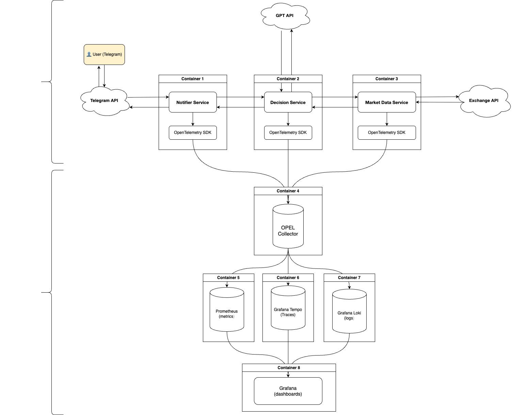

# crypto_telemetry

This project is an educational prototype of a **microservices-based crypto trading bot** instrumented with full observability: **metrics**, **tracing**, and **logging** using **OpenTelemetry**.

The goal is to learn how to design distributed systems with proper **telemetry**, **SLA monitoring**, and **visualization in Grafana**.

---

## 🧩 Architecture Overview

The system consists of three Go microservices and an observability stack:

### 1. **Market Data Service**
- Fetches real-time crypto prices from a public exchange API (e.g., Binance).
- Exposes basic metrics: request count, latency, error rate.
- Sends prices to the Decision Service.

### 2. **Decision Service**
- Receives market data and decides what to do: *Buy*, *Sell*, or *Hold*.
- The logic can be powered by GPT API or a simple randomizer for testing.
- Returns the decision to the Notifier Service.

### 3. **Notifier Service**
- Handles Telegram Bot integration.
- Receives user input (`"What should I do with crypto?"`).
- Coordinates the flow between all services:
  1. Sends a request to Market Data Service.
  2. Forwards the market info to Decision Service.
  3. Sends the resulting decision back to the user.

### 4. **Telemetry & Monitoring Stack**
- **OpenTelemetry Collector** – central router for metrics, traces, and logs.
- **Prometheus** – time-series storage for metrics.
- **Grafana Tempo** – backend for distributed tracing.
- **Grafana** – unified dashboard for metrics, traces, and logs.

---

## Architecture schenme



---

## 🧠 Telemetry Flow Details

| Type | Path | Visualization | Purpose |
|------|------|----------------|----------|
| **Metrics** | Go SDK → OTEL Collector → Prometheus → Grafana | Dashboards | SLA tracking (latency, error rate, throughput) |
| **Traces** | Go SDK → OTEL Collector → Grafana Tempo → Grafana | Trace view | End-to-end request tracing |
| **Logs** | App logger → OTEL Collector → Grafana Loki → Grafana | Explore tab | Contextual error/debug logs |

---

## 📊 Observability Goals

- **Latency** (p95 per service)
- **Error Rate** (per service)
- **Request Throughput (RPS)**
- **Availability / Uptime**
- **End-to-End Traces** across all three services

---

## 🧰 Tech Stack

| Component | Technology |
|------------|-------------|
| Language | Go |
| Communication | HTTP REST |
| Tracing | OpenTelemetry SDK + Collector + Grafana Tempo |
| Metrics | Prometheus |
| Visualization | Grafana |
| Logging (optional) | Loki |
| Container orchestration | Docker Compose |

---

## 🚀 How It Works

1. User presses **"What should I do with crypto?"** in Telegram.
2. Notifier Service triggers Market Data Service → fetches current price.
3. Decision Service decides whether to buy or sell.
4. Notifier sends a response to the Telegram chat.
5. Every request is traced and monitored end-to-end via OpenTelemetry.

---

## ⚙️ Setup & Configuration

### 1. Create `.env` file

Create a `.env` file in the root directory with your API key:

```bash
# Copy example file
cp .env.example .env

# Edit .env and add your API key
EXCHANGE_API_KEY=your_actual_api_key_here
```

### 2. Start services

```bash
# Using Docker Compose
docker-compose up --build
```

### 3. Access services

- **Grafana**: http://localhost:3000 (admin/admin)
- **Prometheus**: http://localhost:9090
- **Data Service**: http://localhost:8080
- **Decision Service**: http://localhost:8081

---


